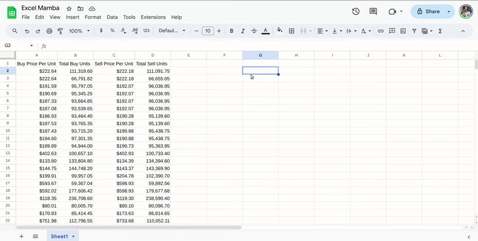
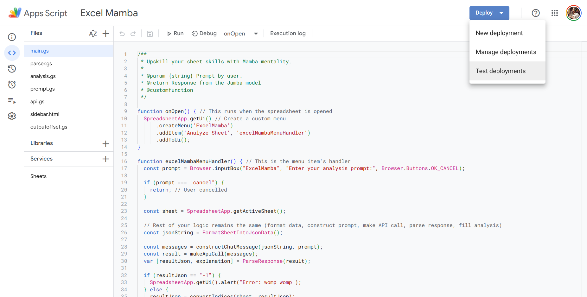
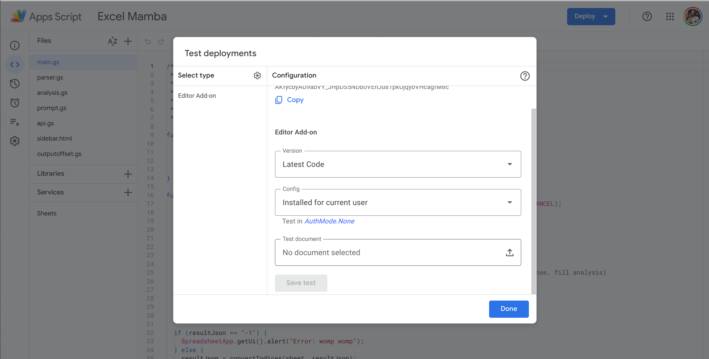

# Excel Mamba
*Runner-up at AGI House Jamba hackathon sponsored by AI21 Labs.*

Excel Mamba is an Apps Script extension that empowers you to automate repetitive data entry tasks in Google Sheets.  Say goodbye to manual data entry and hello to increased efficiency and accuracy!

</img>

## Getting Started

1. Open your Google Sheet and navigate to **Extensions > Apps Script**.
2. Copy the files in this repo to Apps Script. Alternatively, you can use [clasp](https://developers.google.com/apps-script/guides/clasp) if you want to iterate over our POC and use a dedicated CI/CD workflow.
3. Paste your API Key in [api.gs](api.gs).
4. Navigate to **Deploy > Test Deployment**
</img>
5. Add a test and Execute! You may need to authorize Apps Script to modify the contents of your Google Drive
</img>

## Team Members

This POC was developed in collaboration with my teammates [Bhavya Bahl](https://github.com/bhavya01),  [Rohit Jena](https://github.com/rohitrango) and advisor [Bharat Khandelwal](https://github.com/khandelwalbharat) at AGI House Jamba hackathon sponsored by AI21 Labs.

 </img>
